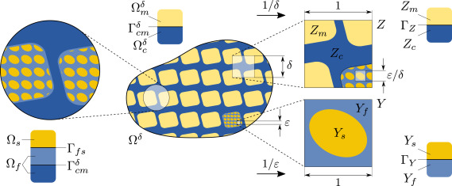
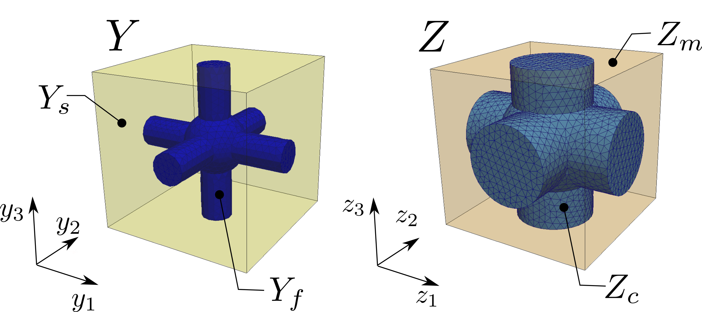
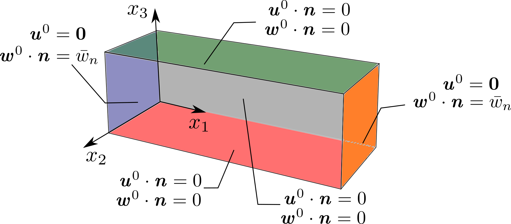
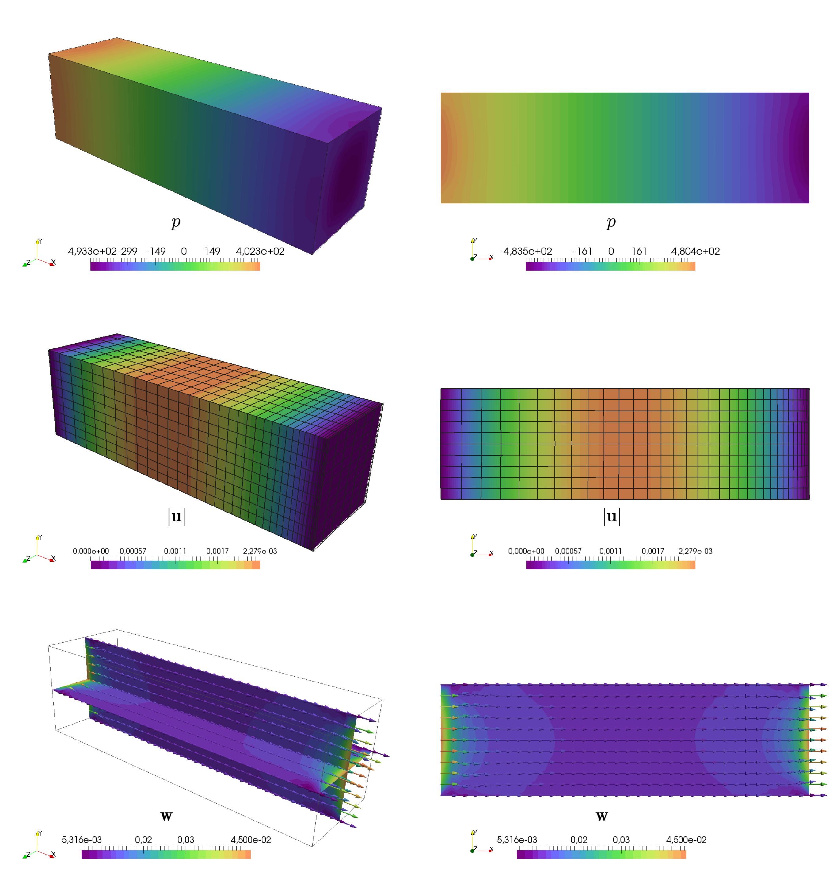

.. example_poropiezo documentation master file, created by
   sphinx-quickstart on Thu Mar 12 09:03:54 2020.
   You can adapt this file completely to your liking, but it should at least
   contain the root `toctree` directive.

.. toctree::
   :maxdepth: 2
   :caption: Contents:

Numerical simulation of viscous flow in deformable double porous media
======================================================================

Mathematical model
------------------

We consider a double porous medium which consists of an elastic solid matrix :math:`\Om_s` perforated by
a system of channels filled with an incompressible fluid :math:`\Om_f` with interface
:math:`\Gamma_{fs}=\overline{\Om_f\cap\Om_s}`. These components are
arranged in a periodic lattice at both the micro- and mesoscopic level.  Thus, the porous matrix at the mesoscopic level
can be generated medium can be generated by copies of the microscopic reference unit cell :math:`Y` and, subsequently,
macroscopic body can be generated as  alattice of the mesoscopic reference unit cell :math:`Z`, see :numref:`fig_domains`.
Two small scale parameters :math:`\veps` and :math:`\delta` chracterize micro- and meso-porosities.
At the mesoscopic scale, the periodic structure is formed by fluid filled channels occupying domain \Om_c^\delta
and by domain :math:`\Om_m^\delta=\Om\setminus\Om_c^\delta` which is constituted by a microporous material.
In particular, domain :math:`\Om_p^{\veps,\delta}\in\Om_m^\delta` represents micro pores saturated by fluid,
whereas :math:`\Om_s^{\veps,\delta}=\Om_m^\delta\setminus\Om_p^{\veps,\delta}` is the skeleton, see :numref:`fig_domains`..

To summarize the decompositions,

.. math::

   &\Om=\Om^\delta_c\cup\Om^\delta_m\cup\Gamma^\delta,\\
   \mbox{solid }&\Om_s\in\Om_m^\delta,\\
   \mbox{microporosity }&\Om_p^{\veps,\delta}=\Om_m^\delta\setminus\Om_s^{\veps,\delta},\\
   \mbox{fluid }&\Om_f=\Om_c^\delta\cup\Om_p^{\veps,\delta}\cup\Gamma_{cp}^{\veps,\delta}.\\

The superscripts :math:`{}^\veps` and :math:`{}^\delta` denote the quantities oscillating within the heterogeneous
structure with the period equal to the size of the micro- and mesoscopic periodic unit. However, we drop the superscript
in following text to simplify the notation.

.. _fig_domains:

   Macroscopic domain :math:`\Omega` and decomposition of microscopic domain :math:`Y` and mesoscopic domain :math:`Z`.

The mechanical behavior of such a structure can be described using the
two-level asymptotic homogenization method, (for more detailed explanaition we  refer to [Rohan2019]_).

The mechanical properties of the deformable matrix are given by elasticity tensor :math:`\Db=(D_{ijkl})` which satisfies
the usual symmetries.

The fluid is characterized by viscosity :math:`\eta` which is given by a piece-wise constant function,

.. math::
   :label: eq-rescaled

   \eta&=\veps^2\eta_p\, \mbox{ in }\Omega_p,\\
   \eta&=\eta_c\, \mbox{ in }\Omega_c.

The scaling of the viscosity in micropores :math:`\Omega_p` is the standart consequence of the non-slip boundary
condition on he pore wall.

The  problem of the fluid flow in deformable media at microscopic level is given by the following
equilibrium equations and boundary conditions governing displacement of the solid :math:`\ub` and both the fluid
pressure and velocity fields :math:`(p,\vb^f)`:

.. math::
   :label: eq-equilibrium

   -\nabla\cdot \Db\eeb{\ub} & = \fb^s, \quad \mbox{ in } \Om_{s}, \\
   \nb\cdot \Db\eeb{\ub} & =\nb\cdot\sigmab^f, \quad \mbox{ on } \Gamma_{fs}, \\
   \nb\cdot \Db\eeb{\ub} & =\nb\cdot\gb^s, \quad \mbox{ on } \partial_\sigma\Omega_{s}, \\
   \ub & =\0b, \quad \mbox{ on } \partial_u\Omega_{s}, \\
   -\nabla\cdot(2\eta\eeb{\vb^f}-p\Ib) & =\fb^f, \quad \mbox{ in } \Omega_{f}, \\
   \nabla\cdot\vb^f & =0, \quad \mbox{ in } \Omega_{f}, \\
   \vb^f & =\dot\ub, \quad \mbox{ on } \Gamma_{fs}, \\
   \vb^f-\dot{\tilde{\ub}} & =:\wb, \quad \mbox{ on } \partial_{ext}\Om_{f},

where :math:`\sigmab^f=\veps^2\eta_p\eeb{\vb^f}-p\Ib` is the fluid stress, :math:`\eeb{\ub}=(e_{ij}(\ub))`
is the strain in the solid with components :math:`e_{ij}(\ub)=1/2(\partial_ju_i+\partial_iu_j)`, :math:`\fb^{s,f}`
denotes the volume forces in the solid or in the fluid, and :math:`\gb^{s,f}` is the surfacetraction stresses acting
on the solid part. The relative fluid velocity :math:`\b=\vb^f-\dot{\tilde{\ub}}` in the fluid-filled pores
:math:`\Om_f` is defined whit use of a smooth extention :math:`\tilde{\ub}` of the dislacement field :math:`\ub`
from solid  :math:`\Om_s` to whole domain :math:`\Om`.

Two-level homogenization
------------------------

Due to the double-porous nature of the medium, we performe two levels of homogenization.
The 1st-level of homogenization concerns the asymptotic analysis :math:`\veps \longrightarrow 0` related to the
fluid-structure interaction in microporous structure situated in :math:`\Omega_m`.
We apply the standard homogenization techniques to the above problem. It
results in the limit model for :math:`\veps \longrightarrow 0`, where
:math:`\veps` is the scale parameter relating the microscopic and macroscopic
length scales. The homogenization process leads to local microscopic problems,
defined within a reference periodic cell :math:`Y` , and to the mesoscopic problem describing
the behavior of the homogenized matrix at the mesoscopic level. The mesoscopic
problem involves the homogenized material coefficients which are evaluated
using the solutions of the local problems. The 2nd-level of homogenization deals with upsacling from meso-
to macroscopic scale. It results in the limit model for
:math:`\delta \longrightarrow 0` and subsequently in the local mesoscopic problems on
a reference periodic cell :math:`Z`, and in the derivation of the homogenized problem at macroscopic level.
Due to linearity of the problem, the microscopic, mesoscopic and macroscopic problems are decoupled.

The local microscopic responses are given by the following sub-problems which are solved within the periodic
reference cell :math:`Y`, see :numref:`fig_domains`, that is decomposed similarly to the decomposition of
domain :math:`\Omega`:

- Find :math:`\omegab^{ij}`, :math:`\omega^{P}` such that for all :math:`\vb` for any :math:`i, j = 1, 2, 3`

.. math::
   :label: eq-corrs-mic1

   \int_{Y_s} \Db \eeby{\omegab^{ij} + \Pib^{ij}}: \eeby{\vb}\,\dV   &= 0, \\
   \int_{Y_{s}} \Db \eeby{\omegab^P}: \eeby{\vb}\,\dV &=
   -{1\over \vert Y\vert}\int_{\Gamma_Y} \vb \cdot \nb^{[s]}\, \dS,

where :math:`\Pi^{ij}_k = y_j \delta_{ik}`.

- Find :math:`\psib^{k}`, :math:`{\pi}^{k}` such that for all :math:`\vb`,
  :math:`q` satisfying

.. math::
   :label: eq-corrs-mic2

   \int_{Y_f} \eta_p \nabla_y{\psib^{k}}: \nabla_y{\vb}\,\dV - \int_{Y_f} \pi^{k}\nabla_y\cdot\vb \,\dV &=
   -\int_{Y_f} v_k\,\dV , \\
   \int_{Y_f} q\nabla_y\cdot\psib^{k} \,\dV &= 0.

The microscopic sub-problems are solved with the periodic boundary conditions
and :math:`Gamma_Y=\overline{Y}_s\cap\overline{Y}_f` is the interface between solid and fluid part of the cell :math:`Y`.

With the characteristic responses obtained by solving local sub-problems,
the homogenized material coefficients :math:`\Ab`, :math:`\Bb`, :math:`\Kb` and :math:`M` can be evaluated
using the following expressions:

.. math::
   :label: eq-coefs-mes

   A_{ijkl} & = {1\over \vert Y\vert} \left[ \int_{Y_{s}} \Db \eeby{\omegab^{kl} + \Pib^{kl}}: \eebz{\omegab^{ij} + \Pib^{ij}}\,\dV\right],\\
   B_{ij} & = \phi_f\delta_{ij}-{1\over \vert Y\vert} \left[\int_{Y_s} \Db \eeby{\omegab^{P}}:\eeby{\Pib^{ij}}\,\dV\right],\\
   K_{ij} & = {1\over \vert Y\vert} \int_{Y_f} \nabla_y\psi^i:\nabla_y\psi^i\,\dV,\\
   M & = {1\over \vert Y\vert} \left[\int_{Y_s} \Db \eeby{\omegab^{P}}:\eeby{\omegab^{P}} \,\dV \right].

Homogenization - 2nd level
--------------------------
At the 2st-level of homogenization, the asymptotic analysis :math:`\delta \longrightarrow 0` is related to the
interaction  between the homogenized microporous matrix in :math:`\Omega_m` and fluid in channels :math:`\Omega_c`
at mesoscopic level. By same upscaling procedure as in 1st level of homogenization, we obtain
local mesoscopic problems,
defined within a reference periodic cell :math:`Z`,
where we enter the homogenized coefficients obtained by 1st level homogenization.
We also arrive to the global problem describing
the behavior of the homogenized matrix at the macroscopic level.
The homogenized material coefficients describing whichdescribe behavior at macroscopic level are evaluated using the
solutions of the local mesoscopic problems.Due to linearity of the problem, the
microscopic, mesoscopic and macroscopic problems are decoupled.

The local mesoscopic responses are given by the following sub-problems which are solved within the periodic
reference cell :math:`Z`, see :numref:`fig_domains`, that is decomposed similarly to the decomposition of
domain :math:`\Omega`:

- Find :math:`\omegab^{ij}`, :math:`\omega^{P}` such that for all :math:`\vb` for any :math:`i, j = 1, 2, 3`

.. math::
   :label: eq-corrs1

   \int_{Z_m} \Ab \eebz{\omegab^{ij} + \Pib^{ij}}: \eebz{\vb}\,\dV   &= 0, \\
   \int_{Z_{m}} \Ab \eebz{\omegab^P}: \eebz{\vb}\,\dV - \int_{Z_m} \Bb: \eebz{\vb} \,\dV &=
    -{1\over \vert Z\vert}\int_{\Gamma_z} \vb \cdot \nb^{[m]}\, \dS ,

where :math:`\Pi^{ij}_k = z_j \delta_{ik}`.

- Find :math:`\pi^k`, :math:`\vphi^k` such that for all :math:`q` satisfying

.. math::
   :label: eq-corrs2

   \int_{Z_{m}} \nabla_z q \Kb \nabla_z \pi^k \,\dV &= -\int_{Z_{m}} \nabla_z q \Kb \nabla_z z_k , \\
   \int_{Z_{m}} \nabla_z q \Kb \nabla_z \vphi^k \,\dV &= -{1\over \vert Z\vert}\int_{\Gamma_z} q \nb^{[c]}_k\, \dS .

- Find :math:`\psib^{ij}`, :math:`\hat{\vphi}^{ij}` such that for all :math:`\vb`,
  :math:`q` satisfying

.. math::
   :label: eq-corrs3

   \int_{Z_c} 2\eta \eebz{\psib^{ij}}: \eebz{\vb}\,\dV - \int_{Z_c} \hat{\vphi}^{ij}\nabla_z\cdot\vb \,\dV &=
   -\int_{Z_{c}} 2\eta \eebz{\Pib^{ij}}: \eebz{\vb}\,\dV , \\
   \int_{Z_c} \nabla_z\cdot\psib^{ij} q \,\dV &= -\int_{Z_c} \nabla_z\cdot\Pib^{ij} q \,\dV.

The mesoscopic sub-problems are solved with the periodic boundary conditions
and :math:`\Gamma_{z} = \overline{Z_m} \cap \overline{Z_c}` is the interface between
the matrix part :math:`Z_m` and canal :math:`Z_c`.

With the characteristic responses obtained by solving local sub-problems,
the homogenized material coefficients :math:`\Acalb`, :math:`\Bcalb`, :math:`\Hcalb`, :math:`\Pcalb`, :math:`\Scalb`, and :math:`\Mcal` can be evaluated
using the following expressions:

.. math::
   :label: eq-coefs-mac

   \Acal_{ijkl} & = {1\over \vert Z\vert} \left[ \int_{Z_{m}} \left[\Ab \eebz{\omegab^{kl}
   + \Pib^{kl}}\right]: \eebz{\omegab^{ij} + \Pib^{ij}}\,\dV\right],\\
   \Bcal_{ij} & = \phi_c\delta_ij+{1\over \vert Z\vert} \left[\int_{Z_m} \Bb: \eebz{\Pib^{ij}+\omegab^{ij}} \,\dV
   - \int_{\Gamma_Z} \nb^{m}\cdot \omegab^{ij} \,\dV\right],\\
   \Hcal_{ij} & = {1\over \vert Z\vert} \int_{Z_m} \nabla_z\vphi^j\cdot\Kb\nabla_z\vphi^i\,\dV,\\
   \Kcal_{ij} & = {1\over \vert Z\vert} \int_{Z_m} \nabla_z(z_j+\pi^j)\cdot\Kb\nabla_z(z_i+\pi^i)\,\dV,\\
   \Pcal_{ij} &= \phi_c\delta_{ij}-{1\over \vert Z\vert}\int_{\Gamma_Z} \pi^i n_j^{m}\, \dS
   =\phi_c\delta_{ij}+{1\over \vert Z\vert} \int_{Z_m} \nabla_z\vphi^j\cdot\Kb\nabla_z\vphi^i\,\dV,\\
   \Scal_{{ijkl}} &={1\over \vert Z\vert}\left[2\eta\int_{Z_c}\eebz{\psib^{kl}+\Pib^{kl}}:\eebz{\psib^{ij}
   +\Pib^{ij}}\,\dV-\int_{Z_c} \hat{\vphi}^{kl}\nabla_z\cdot\Pib^{ij}\, \dV\right],\\
   \Mcal &={1\over \vert Z\vert}\left[\int_{Z_m}M\,\dV+ \int_{Z_m} \Bb: \eebz{\omegab^{P}} \,\dV
   - \int_{\Gamma_Z} \nb^{c}\cdot \omegab^{P} \,\dV\right].

All coefficients are symmetric with respect to indices related to strain and strain rate tensors, i.e. :math:`a_{ij}=a_{ji}`. 

The global macroscopic problem is defined in terms of the homogenized
coefficients as: Find the macroscopic displacements :math:`\ub^0` and
:math:`p^0` such that for all :math:`\vb^0` and :math:`q^0`

.. math::
   :label: eq-macro

   \int_{\Omega} [\Acalb \eebx{\ub^0} - p^0 \Bcalb^T]: \eebx{\vb^0}\,\dV - \int_{\Omega}\vb^0\cdot\Pcalb^T(\nabla_xp^0-\fb^f) &
   - \int_\Omega \vb^0 \Hcalb^T\wb^0\,\dV +\int_{\partial_\sigma\Omega}\bar{\phi}_c\bar{p^0}\nb\cdot\vb^0\,\dV\\
   &=  \int_{\Omega} \fb^{blk}\cdot\vb^0 \,\dV+\int_{\partial_\sigma\Omega}\bar{\phi}_m\bar{\phi}_s\gb\cdot\vb^0\,\dV,
   + \int_{\Omega} f \cdot \vb \dV,\\
   \int_{\Omega} q^0(\Bcalb:\eebx{\dot\ub^0} + \dot p^0 \Mcal) \dV +\int_\Omega (\Kcalb(\nabla_xp^0-\fb^f)-\Pcalb\wb^0)\,\dV
   &= -\int_{\partial_w\Omega} q^0 (\bar\phi_m\bar\phi_f\bar w_n^{mic}+\bar\phi_c\bar w_n^{mes}) \,\dV,\\
   \int_{\Omega}\eebx{\thetab^0}:\Scalb\eebx{\wb^0+\dot\ub^0}\,\dV+\int_\Omega\thetab^0\cdot\Pcalb(\nabla_xp^0-\fb^f)\,\dV
   +\int_\Omega\Hcalb\wb^0 &=\int_{\partial_p\Omega}\bar\phi_c\bar p^0\nb\cdot\thetab^0\,\dV.

The Dirichlet boundary conditions prescribed for :math:`\ub^0` and :math:`\wb^0` can be imposed,

.. math::
   :label: boundary_dir

   \ub^0&=\bar{\ub}^0\; \textrm{ on }\partial_u\Om,\\
   \wb^0&=\bar{\wb}^0\; \textrm{ on }\partial_w\Om.

The pressure :math:`p^0` fulfils zero-means conditions :math:`\int_\Om p^0=0` in the whole domain :math:`\Om`.

The complementary Neumann-type boundary condition are specfied as follows

.. math::
   :label: boundary_neu

   \nb\cdot(\Acalb \eebx{\ub^0} - p^0 \Bcalb^T)&=-\bar{\phi}_c\bar{p^0}\nb+\bar{\phi}_m\bar{\phi}_s\gb=\0b
   \; \textrm{ on }\partial_\sigma\Om,\\
   \nb\cdot(\Kcalb(\nabla_xp^0-\fb^f)-\Pcalb\wb^0)&=\bar\phi_m\bar\phi_f\bar w_n^{mic}+\bar\phi_c\bar w_n^{mes}
   \; \textrm{ on }\partial_j\Om,\\
   \nb\cdot\Scalb\eebx{\wb^0+\dot\ub^0}&=\bar\phi_c\bar{p}^0\nb=\0b\; \textrm{ on }\partial_p\Om.

For the purpose of this example, we simplify the problem :eq:`eq-macro2`. We consider only steady
state of the problem and omitt all volume froces
:math:`\fb^f` and :math:`\fb^{blk}` and surface tractions :math:`\gb`. Also we will consider
closed micropores on the whole boundary :math:`\partial\Om`, *i.e.* :math:`w_n^{mic}=0`.
The problem :eq:`eq-macro` becomes:
Find the macroscopic displacements :math:`\ub^0` and
:math:`p^0` such that for all :math:`\vb^0` and :math:`q^0`

.. math::
   :label: eq-macro2

   \int_{\Omega} [\Acalb \eebx{\ub^0} - p^0 \Bcalb^T]: \eebx{\vb^0}\,\dV - \int_{\Omega}\vb^0\cdot\Pcalb^T\nabla_xp^0
   - \int_\Omega \vb^0 \Hcalb^T\wb^0\,\dV&= 0\\
   \int_\Omega (\Kcalb\nabla_xp^0-\Pcalb\wb^0)\,\dV
   &= -\int_{\partial_w\Omega} q^0 \bar\phi_c\bar w_n^{mes} \,\dV,\\
   \int_{\Omega}\eebx{\thetab^0}:\Scalb\eebx{\wb^0}\,\dV+\int_\Omega\thetab^0\cdot\Pcalb\nabla_xp^0\,\dV+\int_\Omega\Hcalb\wb^0 &=0.

Numerical simulation
--------------------
.. _fig_cells:

   Left - geometric representation of microscopic domain; Riht - geometric representation of mesoscopic domain

To run the numerical simulation, download the
`archive <https://github.com/turjani/archive/example_BDB.zip>`_,
unpack it in the main SfePy directory and type:

.. code::

   ./simple.py example_perfusion_BDB/perf_BDB_mac.py

This invoke the :code:`simply.py` script which calculates the macroscopic
problem :eq:`eq-macro2` and calls the homogenization engine that solves the
local subproblems for given parameter :math:`\veps`, viscosity :math:`\eta` and elastic tensor :math:`\Db`. First, it solves subproblems  :eq:`eq-corrs-mic1` and :eq:`eq-corrs-mic2`
on microscopic cell :math:`Y` (see :numref:`fig_cells` left) and
evaluates the homogenized
coefficients :eq:`eq-coefs-mes`. Then, using solution from previous step, it solves subproblems
:eq:`eq-corrs1`--:eq:`eq-corrs3` on mesoscopic cell :math:`Z` (see :numref:`fig_cells` right)
and evaluates the homogenized coefficients :eq:`eq-coefs-mac`. See [CimrmanLukesRohan2019]_ for more details related
to the SfePy homogenization engine.

The macroscopic sample is fixed on both left and right side, so that no displacements are
allowed, see :numref:`fig_bc`. The defromation is induced due to the flow through porous matrix, as the
responce to the prescribed velocity :math:`\bar\wb_n`, see :eq:`eq-macro2`.

.. _fig_bc:

   Boundary conditions applied at the macroscopic level

The resultin macroscopic pressure field :math:`p`, displacement :math:`\ub` and the velocity field :math:`\wb` are depicted in
:numref:`fig_macro_results`, where deformation is visualised by deformed wireframe.

.. _fig_macro_results:

   Macroscopic sample and the resulting macroscopic fields: left - 3D view of pressure
   :math:`p`, displacement :math:`\ub` and velocity field :math:`\wb`; right - pressure
   :math:`p`, displacement :math:`\ub` and velocity field :math:`\wb` in :math:`xy`-crosssection.

References
----------

.. [Rohan2019] Rohan E., Turjanicová J., Lukeš V. The Biot–Darcy–Brinkman model of flow
   in deformable double porous media; homogenization and numerical modelling.
   Computers and Mathematics with applications, 78(9):3044-3066, 2019,
   `DOI:10.1016/j.camwa.2019.04.004 <https://doi.org/10.1016/j.camwa.2019.04.004>`_

.. [CimrmanLukesRohan2019] Cimrman R., Lukes V., Rohan E.
   Multiscale finite element calculations in Python using SfePy.
   Advances in Computational Mathematics, 45(4):1897-1921, 2019,
   `DOI:10.1007/s10444-019-09666-0 <https://doi.org/10.1007/s10444-019-09666-0>`_

